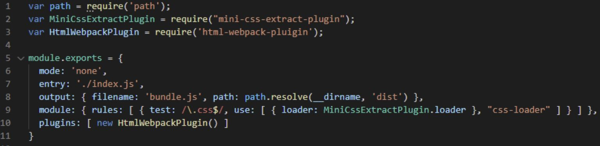

<h2 align="center">
Webpack을 React에 적용하기
</h2>

<h5 align="center">참고 : Create-React-App, Next.js는 시작부터 웹팩이 적용되어 있습니다.</h5><br/><br/>

[ Contents ] <br/>
[짧은 용어 설명](#word) <br/>
[왜 파일들을 하나로 묶는가](#why) <br/>
[Webpack 의 입력값](#input) <br/>
[Webpack 실행하기](#run) <br/><br/>

// 웹팩의 코딩 문법은 webpack.config.js 를 참고하세요.
<br/>
<br/>

## 🐱‍🐉 짧은 용어 설명<a name = "word"></a>

1. 모듈 : 구성요소. Webapck에서는, '파일 한 개' 로 이해하자.<br/>
2. 번들 : 묶음 (여러 개가 1개로 묶여진 것) <br/>
3. 모듈 번들러 : 여러 파일들을 한개로 묶어주는 것.
4. Webpack에서의 모듈 : javascript파일, image, css 파일 등.<br/><br/>

## 🧞‍♂️ 왜 파일들을 하나로 묶는가 ?<a name = "why"></a>

1. 로딩 속도 향상

- 서버로 요청하는 파일 개수를 줄일수록, 불러오는 시간이 줄어든다.
- 한 번에 수십, 수백개의 파일들을 불러오는 경우도 생긴다.<br/>
  ( 불러온 js파일이 require한, js파일이 또 require한 js파일 까지도 가져오는... )
- Lazy Loading 또한 사용 가능. ( 화면에 안보이는 것을, 미리 불러오지 않기 )<br/><br/>

2. 번수 유효범위 문제

- html 파일에서 여러 js파일들을 호출했는데, 서로 중복된 변수명이 있었다면?
- 분리된 각각의 파일들 임에도, 변수를 한 번 더 선언한 것처럼 작동됨.<br/>
  ( var형이면 덮어쓰기. let, const는 재선언 에러 )
- 파일마다 변수 유효범위를 각각 갖게 해준다. <br/><br/>

3. (Webpack의 특징) 개발 작업 자동화 도구

- 사실 모듈 번들러가 아니라, Webpack의 특징.
- hot reload : 코드 저장하면 자동 새로고침.
- dev-server : 작은 개발 서버를 띄워서, 브라우저에서 프로젝트를 실행해보게 해준다.
- HTML, CSS, JS를 압축과 이미지 압축, CSS 전처리기 변환 등등 가능.<br/><br/>

## 😉 Webpack의 입력값 <a name = "input"></a>

- webpack.config.js의 기본적인 6가지 입력값의 종류입니다.<br/>
  ( 자세한 설명은, webpack.config.js을 읽는 것을 추천합니다. )

1. mode : 웹팩 모드 설정. (개발 or 배포용 or 설정없이)
2. entry : 웹팩의 시작점이 되는 js파일의 위치.
3. output : 번들된 파일의 이름과 위치.
4. module : '번들 도중에', 적용할 도구들. (= loader들)
5. plugins : '번들이 된 후', 결과물에 적용할 도구들. (= plugin들)
6. devServer : 브라우저에 띄워볼 수 있게, 작은 서버 실행.

<p align="center">
  
</p>

<br/><br/>

## 🤠 Webpack 실행하기 <a name = "run"></a>

```
// 의존 모듈 설치
npm i

// 개발버전 빌드하기
npm run webpack-build-dev    // webpack --mode development


// 개발버전 빌드한 후, 개발 서버로 실행해보기
npm run webpack-run-dev      // webpack --mode development && webpack-dev-server ]


// 운영버전 빌드하기
npm run webpack-build-prod   // webpack --mode production
```

<br/><br/>
